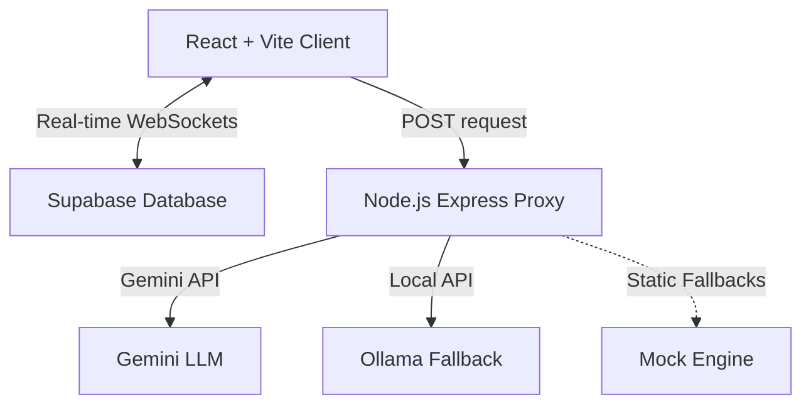

# ⚡ ClassPulse — AI Classroom & Secure Exam Suite

ClassPulse is an elegant, premium,web application built for modern classrooms. It integrates **live lectures audio transcription**, **automated AI quiz generation**, **real-time student response trackings**, and a **hardened anti-cheat live exam browser** to create a complete educational loop.

Designed with a sleek, minimal, glassmorphic layout, ClassPulse provides educators and students with a high-fidelity dashboard that feels like a native macOS app.

---

## ✨ Features

### 🎙️ Live Lecture & AI Question Generation (Teacher Panel)
* **Live Audio Transcription**: Uses the Web Speech API to transcribe lectures in real-time as the instructor speaks.
* **Instant MCQ Quizzing**: The instructor can select a question count (5, 7, or 10) and use AI to automatically generate context-aware multiple-choice questions from the transcript.
* **Real-time Question Release**: Live editing of questions and options before releasing them instantly to students over WebSockets.
* **AI Summary Guides**: Generates detailed, structured markdown lecture summary study guides at the end of the session, even providing custom syllabus summaries if transcript inputs are short.

### 🔒 Hardened Secure Exam Browser (Student Panel)
* **OCR-Defeating Question Canvas**: Renders questions on an HTML5 canvas layer with high-frequency pixel grain noise and mathematical distortion overlays to disrupt OCR engines and copy extensions.
* **Keyboard & Click Blocker**: Captures and blocks context-menu right-clicks and common keyboard copy/print shortcuts (Ctrl+C, Ctrl+A, Ctrl+P, PrintScreen) to lock down the screen.
* **Focus & Tab Departure Monitoring**: Subscribes to `visibilitychange` and window `blur` events to track window departure. Flags are logged immediately to the teacher's dashboard.
* **Auto-Lockout**: Automatically locks out students from the exam on a second violation, auto-submitting their existing progress.
* **Sound-Synthesizing Circular Timer**: Features an SVG circular countdown timer that shifts from green (safe) to yellow (caution) to red (urgent) and synthesizes ticking sounds using the Web Audio API.

### 📊 Real-time Analytics & Leaderboards
* **Live WebSocket Leaderboards**: Features live sorted Trohpy-ranked student scoreboards updating instantly as answers are submitted.
* **Interactive Accuracy Charting**: Tracks class question accuracies and displays color-graded percentage stats.
* **Security Auditing**: Displays a chronological list of student academic integrity flags and violations for the teacher.
* **Student Accuracy & Rank Tracker**: Computes real-time student class rank and response accuracy dynamically using Supabase relational tables.

---

## 🛠️ Tech Stack & Architecture



### Frontend
* **React 19** with **Vite** for fast hot module replacement (HMR).
* **Vanilla CSS** with tailored variable tokens for Apple colors, glassmorphism shadows, and ambient blurred background filters.
* **Lucide Icons** for clean, modern icon representations.
* **Canvas Confetti** for completion celebrations.

### Backend Proxy Server
* **Node.js Express** proxy serving AI routes:
  - `POST /api/generate-questions`: Fallback-chained AI parsing.
  - `POST /api/summarize-lecture`: Lecture summarizer.
* **AI Fallback Chain**: System prioritizes **Gemini 2.0 Flash Lite** $\rightarrow$ **Ollama (local Gemma2:2b)** $\rightarrow$ **Custom Class/Syllabus Mock Engine** to guarantee execution uptime regardless of internet connectivity or API quotas.

### Database
* **Supabase PostgreSQL** implementing:
  - Row Level Security (RLS) policies for granular multi-tenant isolation.
  - Relational database schema (`users`, `classes`, `enrollments`, `sessions`, `questions`, `answers`, `attendance`, `cheat_logs`, `assignments`, `submissions`).
  - Auth-to-public-profile trigger mapping (`public.handle_new_user()`).
  - Real-time channel broadcasts.

---

## 🚀 Setup & Installation

### 1. Database Configuration
1. Open a new project on **Supabase**.
2. Go to the **SQL Editor** tab and execute the contents of [schema.sql](file:///c:/Users/santhosh/OneDrive/Desktop/class%20pulse/schema.sql) to build the database structure, triggers, and permissions.
3. In the Database settings, make sure to enable **Realtime** on the following tables: `sessions`, `questions`, `answers`, `attendance`, and `cheat_logs`.

### 2. Local Environment Setup
Create a `.env.local` file at the root folder of the project:
```env
VITE_SUPABASE_URL=https://your-supabase-url.supabase.co
VITE_SUPABASE_ANON_KEY=your-supabase-anonymous-api-key
```

Create a `.env` file inside the `/server` directory to configure your AI providers:
```env
GEMINI_API_KEY=your-gemini-api-key
# Optional: customize local Ollama parameters
OLLAMA_URL=http://localhost:11434
OLLAMA_MODEL=gemma2:2b
```

### 3. Install Dependencies & Launch
Run the following command at the project root to install npm modules:
```bash
npm install
```

Launch both the React Client and Express Proxy concurrently using:
```bash
npm run dev
```

* **Client Browser**: Open [http://localhost:5173](http://localhost:5173) to access the application.
* **Backend Endpoint**: Running proxy server can be visited at [http://localhost:3001](http://localhost:3001).

---

## 📂 Project Structure

```
├── public/                 # Static assets and icons
├── server/
│   ├── index.js            # Express API server (Gemini/Ollama proxy)
│   └── .env                # Server API credentials (ignored)
├── src/
│   ├── assets/             # Images and SVG icons
│   ├── components/         # Common layouts, timers, modals, canvas graphics
│   ├── hooks/              # Custom hooks (Anti-cheat listeners)
│   ├── pages/              # Auth, analytics, and dashboards (Teacher/Student)
│   ├── supabaseClient.js   # Supabase client instantiation
│   ├── index.css           # Apple macOS custom styling tokens
│   └── main.jsx            # Application entry point
├── schema.sql              # Supabase table definitions and triggers
└── package.json            # Client and server dependency packages
```

---

## 🎓 Academic Integrity
ClassPulse is built with student privacy and academic fairness in mind. The anti-cheat indicators do not gather files, system data, or personal details; they monitor focus shifts and tab switches strictly within the browser context during active testing sessions.
